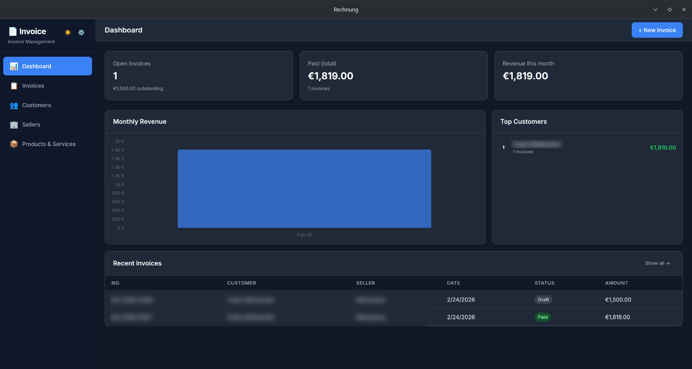

# Invoice - Modern Invoice Management

A beautiful, local-first Desktop Application for managing your customers, products, and invoices. Built for freelancers and small businesses who value data privacy and offline capability.



## ✨ Features

- **📊 Dashboard Overview**: Keep track of unpaid invoices, monthly revenue, and top customers.
- **💼 Customer & Product Management**: Store your clients and reusable products/services locally for quick invoice creation.
- **🧾 Beautiful PDF Exports**: Generate professional PDF invoices with automatic tax and total calculations.
- **🌓 Dark Mode**: Seamless support for Light and Dark themes.
- **🌐 Bilingual Support**: Available in German and English.
- **🔒 Local & Private**: 100% offline-first. Your data stays on your machine in a local SQLite database – no subscriptions, no cloud.
- **💾 Backup & Restore**: Easily export and import your `.db` database to secure your data or move to another machine.

## 🛠️ Technology Stack

- **[Tauri v2](https://v2.tauri.app/)**: Rust-based framework for building tiny, fast, and secure desktop applications.
- **[Vue 3](https://vuejs.org/)**: The progressive JavaScript framework for the frontend interface.
- **[Vite](https://vitejs.dev/)**: Next-generation frontend tooling.
- **[TypeScript](https://www.typescriptlang.org/)**: Strongly typed programming language.
- **SQLite**: Using Tauri's SQL plugin for local data persistence.

## 📥 Download & Installation

You can find the latest release for your platform (Windows, macOS, Linux) under the **[Releases](https://github.com/Psychotoxical/invoice/releases)** tab.

For a detailed list of new features and fixes across updates, see the **[Changelog](CHANGELOG.md)**.

## 🚀 Development Setup

If you want to contribute or build the application yourself, make sure you have the [Tauri prerequisites](https://v2.tauri.app/start/prerequisites/) installed (Node.js, Rust, and system dependencies).

```bash
# Clone the repository
git clone https://github.com/Psychotoxical/invoice.git
cd invoice

# Install dependencies
npm install

# Run in development mode
npm run tauri dev

# Build for production
npm run tauri build
```

## 📜 License

This project is licensed under the **MIT License**. See the `LICENSE` file for details.

---

*Note: This application was entirely **vibecoded**.*

The reason for this is that I had been searching for a simple invoicing tool to cover my needs for ages. However, the tools I found were either massive ERP systems, too expensive, poorly designed, or stuffed with ads. 

I know that *vibecoding* doesn't have the best reputation in parts of the Open Source community. To those critics, I have a simple tip: just don't use it and keep scrolling. And to everyone else who actually has a use for this tool: I hope you enjoy the app!

Thankfully, *vibecoding* has given me the incredible opportunity to bring my many ideas to life—ideas that I simply do not have the technical skills to build myself. A huge thank you to Antigravity for making this possible! 😉
